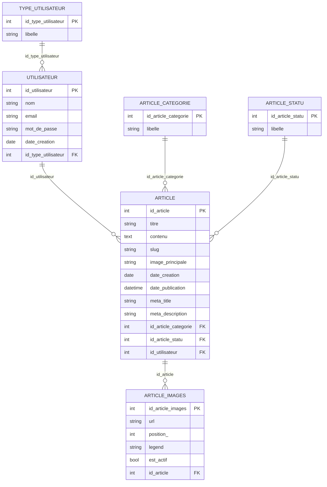

# Documentation Technique - Mini-projet Iran

## 1. Informations generales

- Projet: Mini-projet Iran (FrontOffice + BackOffice + PostgreSQL)
- Stack: PHP natif, Apache (Docker), PostgreSQL
- FrontOffice: http://localhost:8080
- BackOffice: http://localhost:8081

## 2. Equipe (Num ETU)

- ETU003241 - ANDRIAMAROZAKA Lovaniaina Nathanael
- ETU003337 - RANDRIAMANANJARA Mamisoa Laurent

## 3. Captures d'ecran FrontOffice (1 capture par feature)

### Feature FO-01 - Liste des articles

Capture:

Explication:
- Affichage de la liste avec article principal, cartes d'articles et pagination.
- Les liens utilisent des URLs propres de type /articles/{slug}.

### Feature FO-02 - Detail d'un article

Capture:

Explication:
- Affichage du contenu HTML de l'article, image de couverture et galerie associee.
- Metadonnees article visibles (categorie, date, auteur si present).

### Feature FO-03 - Recherche et filtre par categorie

Capture:

Explication:
- Barre de recherche plein texte + filtres categories.
- Requete combinee: mot-cle + categorie + pagination.

### Feature FO-04 - Navigation categories en mobile

Capture:

Explication:
- Navigation categories adaptee mobile en grille pour eviter les categories coupees.
- Zones cliquables optimisees pour tactile.

### Feature FO-05 - SEO technique (robots/sitemap)

Capture:

Explication:
- Endpoint robots.txt dynamique.
- Endpoint sitemap.xml dynamique construit a partir des articles publies.

### Feature FO-06 - Performance images (Lighthouse / Network)

Capture:

Explication:
- Activation cache HTTP + compression GZip/Deflate.
- Redimensionnement dynamique des images (logo, hero, miniatures, galerie) + WebP + srcset/sizes.

## 4. Captures d'ecran BackOffice (1 capture par feature)

### Feature BO-01 - Authentification (Login/Register)

Capture:

Explication:
- Ecran de connexion pour les administrateurs et redacteurs.
- Routes: /login, /register, /logout
- Comptes precharges dans la base (voir section 6).

### Feature BO-02 - Gestion des articles (CRUD)

Capture:

Explication:
- Affichage de la liste des articles avec filtres (recherche, categorie, statut, auteur pour admins).
- Routes: GET /articles, GET /articles/create, POST /articles/create, GET /articles/edit, POST /articles/edit
- Actions: creer, editer, publier, archiver, supprimer.

### Feature BO-03 - Editeur d'articles avec TinyMCE

Capture:

Explication:
- Editeur WYSIWYG pour le contenu des articles (TinyMCE).
- Upload d'images directement dans l'editeur via endpoint /articles/upload-tinymce.
- Images sauvegardees dans /uploads/articles/content/.
- Meta-donnees (titre, description, slug, categorie) generees automatiquement.

### Feature BO-04 - Publication et archivage d'articles

Capture:

Explication:
- Passages de statut: Brouillon -> Publié -> Archivé.
- Routes POST: /articles/publish, /articles/archive, /articles/destroy.
- Seuls les admins et proprietaires peuvent modifier les articles.

### Feature BO-05 - Gestion des categories

Capture:

Explication:
- Interface CRUD pour gerer les categories d'articles.
- Routes: GET /categories, GET /categories/create, POST /categories/create, GET /categories/edit, POST /categories/edit, POST /categories/destroy.
- Categories precharges: Politique, Conflits, Economie, Culture, Sante.

### Feature BO-06 - Gestion des utilisateurs (Admin only)

Capture:

Explication:
- Interface d'administration des utilisateurs (Admin seulement).
- Routes: GET /users, GET /users/create, POST /users/create, GET /users/edit, POST /users/edit, GET /users/show.
- Types: Admin (type=1) et Redacteur (type=2).
- Controle d'acces: les redacteurs ne voient que leurs propres articles.

## 5. Modelisation de la base de donnees

### 5.1 Tables principales

- type_utilisateur
- utilisateur
- article_statu
- article_categorie
- article
- article_images

### 5.2 Relations (ERD simplifie)

## 6. BackOffice - compte par defaut (user/pass)

Source: seed SQL du projet.

- Admin BackOffice
  - Email: admin@irannews.com
  - Mot de passe: AdminPass123
  - Droits: acces complet (articles, categories, utilisateurs)

- Redacteur
  - Email: redacteur@irannews.com
  - Mot de passe: RedacPass123
  - Droits: gestion de ses articles uniquement

URL et routes BackOffice:
- URL BackOffice: http://localhost:8081
- Route d'accueil apres connexion: http://localhost:8081/accueil
- Route de login: http://localhost:8081/login
- Route de deconnexion: POST sur /logout

## 7. BackOffice - Routes disponibles

### Authentication
- GET /login - Formulaire de connexion
- POST /login - Traitement de la connexion
- GET /register - Formulaire d'inscription
- POST /register - Traitement de l'inscription
- POST /logout - Deconnexion

### Accueil
- GET /accueil - Ecran d'accueil

### Articles
- GET /articles - Liste des articles (avec filtres)
- GET /articles/create - Formulaire de creation
- POST /articles/create - Creation d'article
- GET /articles/edit?id=X - Formulaire d'edition
- POST /articles/edit?id=X - Mise a jour d'article
- POST /articles/publish?id=X - Publier un article
- POST /articles/archive?id=X - Archiver un article
- POST /articles/destroy?id=X - Supprimer un article
- POST /articles/upload-tinymce - Upload d'image dans TinyMCE (AJAX)

### Categories
- GET /categories - Liste des categories
- GET /categories/create - Formulaire de creation
- POST /categories/create - Creation de categorie
- GET /categories/edit?id=X - Formulaire d'edition
- POST /categories/edit?id=X - Mise a jour de categorie
- POST /categories/destroy?id=X - Suppression de categorie

### Users (Admin only)
- GET /users - Liste des utilisateurs
- GET /users/create - Formulaire de creation
- POST /users/create - Creation d'utilisateur
- GET /users/edit?id=X - Formulaire d'edition
- POST /users/edit?id=X - Mise a jour d'utilisateur
- GET /users/show?id=X - Detail d'un utilisateur

## 8. Checklist de finalisation document

- [x] Routes et URLs documentees correctement
- [x] Comptes par defaut verifies et documentes
- [x] Tables de base de donnees validees
- [x] Features BackOffice documentees (6 features principales)
- [ ] Remplacer toutes les captures placeholders par vos vraies captures
- [ ] Verifier les droits d'acces pour les redacteurs vs admins
- [ ] Exporter ce fichier en .doc si necessaire pour la livraison finale
