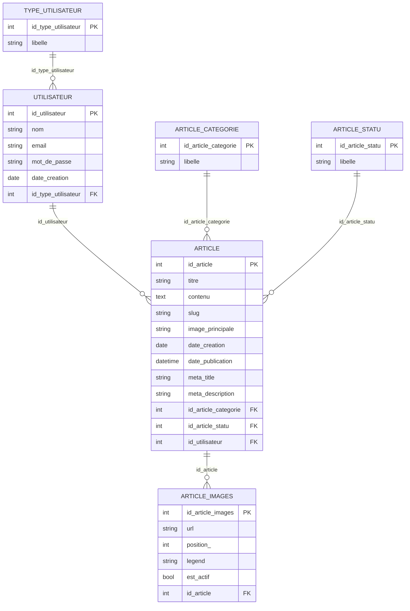

# Documentation Technique - Mini-projet Iran

## Sommaire

1. [Équipe (Num ETU)](#1-équipe-num-etu)
2. [Captures d'écran FrontOffice](#2-captures-décran-frontoffice)
3. [Captures d'écran BackOffice](#3-captures-décran-backoffice)
4. [Modélisation de la base de données](#4-modélisation-de-la-base-de-données)
5. [BackOffice - compte par défaut (user/pass)](#5-backoffice---compte-par-défaut-userpass)
6. [BackOffice - Routes disponibles](#6-backoffice---routes-disponibles)

## Informations générales

- Projet: Mini-projet Iran (FrontOffice + BackOffice + PostgreSQL)
- Stack: PHP natif, Apache (Docker), PostgreSQL
- FrontOffice: http://localhost:8080
- BackOffice: http://localhost:8081

## 1. Équipe (Num ETU)

- ETU003241 - ANDRIAMAROZAKA Lovaniaina Nathanael
- ETU003337 - RANDRIAMANANJARA Mamisoa Laurent

Répartition synthétique des tâches réalisées:

- ETU003241 a principalement pris en charge le volet BackOffice et base de données: structure SQL, gestion des comptes, logique d'administration, routes BackOffice et briques SEO techniques côté serveur.
- ETU003337 a principalement pris en charge le FrontOffice et l'expérience utilisateur: pages publiques, navigation, responsive/mobile, optimisation SEO on-page et performance (cache, images, chargement).

Lien TODO list (Google Sheet):

- [À compléter - Google Sheet de suivi des tâches](https://docs.google.com/spreadsheets/d/TO_BE_REPLACED)

## 2. Captures d'écran FrontOffice

### Feature FO-01 - Liste des articles

Capture:

Explication:
- Affichage de la liste avec article principal, cartes d'articles et pagination.
- Les liens utilisent des URLs propres de type /articles/{slug}.

### Feature FO-02 - Détail d'un article

Capture:

Explication:
- Affichage du contenu HTML de l'article, image de couverture et galerie associée.
- Métadonnées article visibles (catégorie, date, auteur si présent).

### Feature FO-03 - Recherche et filtre par catégorie

Capture:

Explication:
- Barre de recherche plein texte + filtres catégories.
- Requête combinée: mot-clé + catégorie + pagination.

### Feature FO-04 - Navigation catégories en mobile

Capture:

Explication:
- Navigation catégories adaptée mobile en grille pour éviter les catégories coupées.
- Zones cliquables optimisées pour tactile.

### Feature FO-05 - SEO technique (robots/sitemap)

Capture:

Explication:
- Endpoint robots.txt dynamique.
- Endpoint sitemap.xml dynamique construit à partir des articles publiés.

### Feature FO-06 - Performance images (Lighthouse / Network)

Capture:

Explication:
- Activation cache HTTP + compression GZip/Deflate.
- Redimensionnement dynamique des images (logo, hero, miniatures, galerie) + WebP + srcset/sizes.

## 3. Captures d'écran BackOffice

### Feature BO-01 - Authentification (Login/Register)

Capture:

Explication:
- Écran de connexion pour les administrateurs et rédacteurs.
- Routes: /login, /register, /logout
- Comptes préchargés dans la base (voir section 5).

### Feature BO-02 - Gestion des articles (CRUD)

Capture:

Explication:
- Affichage de la liste des articles avec filtres (recherche, catégorie, statut, auteur pour admins).
- Routes: GET /articles, GET /articles/create, POST /articles/create, GET /articles/edit, POST /articles/edit
- Actions: créer, éditer, publier, archiver, supprimer.

### Feature BO-03 - Éditeur d'articles avec TinyMCE

Capture:

Explication:
- Éditeur WYSIWYG pour le contenu des articles (TinyMCE).
- Upload d'images directement dans l'éditeur via endpoint /articles/upload-tinymce.
- Images sauvegardées dans /uploads/articles/content/.
- Métadonnées (titre, description, slug, catégorie) générées automatiquement.

### Feature BO-04 - Publication et archivage d'articles

Capture:

Explication:
- Passages de statut: Brouillon -> Publié -> Archivé.
- Routes POST: /articles/publish, /articles/archive, /articles/destroy.
- Seuls les admins et propriétaires peuvent modifier les articles.

### Feature BO-05 - Gestion des catégories

Capture:

Explication:
- Interface CRUD pour gérer les catégories d'articles.
- Routes: GET /categories, GET /categories/create, POST /categories/create, GET /categories/edit, POST /categories/edit, POST /categories/destroy.
- Catégories préchargées: Politique, Conflits, Économie, Culture, Santé.

### Feature BO-06 - Gestion des utilisateurs (Admin only)

Capture:

Explication:
- Interface d'administration des utilisateurs (Admin seulement).
- Routes: GET /users, GET /users/create, POST /users/create, GET /users/edit, POST /users/edit, GET /users/show.
- Types: Admin (type=1) et Rédacteur (type=2).
- Contrôle d'accès: les rédacteurs ne voient que leurs propres articles.

## 4. Modélisation de la base de données

### 5.1 Tables principales

- type_utilisateur
- utilisateur
- article_statu
- article_categorie
- article
- article_images

### 5.2 Relations (ERD simplifié)

## 5. BackOffice - compte par défaut (user/pass)

Source: seed SQL du projet.

- Admin BackOffice
  - Email: admin@irannews.com
  - Mot de passe: AdminPass123
  - Droits: accès complet (articles, catégories, utilisateurs)

- Rédacteur
  - Email: redacteur@irannews.com
  - Mot de passe: RedacPass123
  - Droits: gestion de ses articles uniquement

URL et routes BackOffice:
- URL BackOffice: http://localhost:8081
- Route d'accueil après connexion: http://localhost:8081/accueil
- Route de login: http://localhost:8081/login
- Route de déconnexion: POST sur /logout

## 6. BackOffice - Routes disponibles

### Authentication
- GET /login - Formulaire de connexion
- POST /login - Traitement de la connexion
- GET /register - Formulaire d'inscription
- POST /register - Traitement de l'inscription
- POST /logout - Déconnexion

### Accueil
- GET /accueil - Écran d'accueil

### Articles
- GET /articles - Liste des articles (avec filtres)
- GET /articles/create - Formulaire de création
- POST /articles/create - Création d'article
- GET /articles/edit?id=X - Formulaire d'édition
- POST /articles/edit?id=X - Mise à jour d'article
- POST /articles/publish?id=X - Publier un article
- POST /articles/archive?id=X - Archiver un article
- POST /articles/destroy?id=X - Supprimer un article
- POST /articles/upload-tinymce - Upload d'image dans TinyMCE (AJAX)

### Categories
- GET /categories - Liste des catégories
- GET /categories/create - Formulaire de création
- POST /categories/create - Création de catégorie
- GET /categories/edit?id=X - Formulaire d'édition
- POST /categories/edit?id=X - Mise à jour de catégorie
- POST /categories/destroy?id=X - Suppression de catégorie

### Users (Admin only)
- GET /users - Liste des utilisateurs
- GET /users/create - Formulaire de création
- POST /users/create - Création d'utilisateur
- GET /users/edit?id=X - Formulaire d'édition
- POST /users/edit?id=X - Mise à jour d'utilisateur
- GET /users/show?id=X - Détail d'un utilisateur
