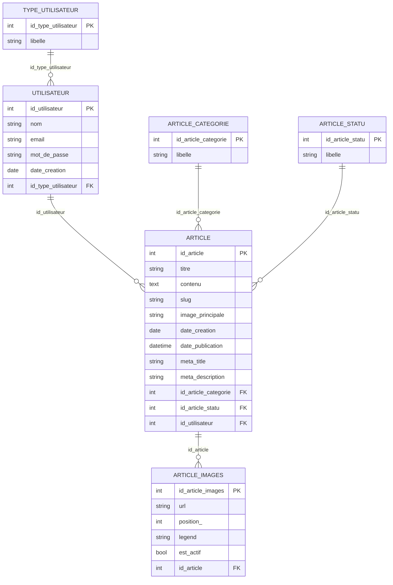

# Documentation Technique - Mini-projet Iran

## 1. Informations generales

- Projet: Mini-projet Iran (FrontOffice + BackOffice + PostgreSQL)
- Stack: PHP natif, Apache (Docker), PostgreSQL
- FrontOffice: http://localhost:8080
- BackOffice: http://localhost:8081

## 2. Equipe (Num ETU)

- ETU003241
- ETU003337

## 3. Captures d'ecran FrontOffice (1 capture par feature)

### Feature FO-01 - Liste des articles

Capture:

Explication:
- Affichage de la liste avec article principal (featured), cartes d'articles et pagination.
- Les liens utilisent des URLs propres de type /articles/{slug}.

### Feature FO-02 - Detail d'un article

Capture:

Explication:
- Affichage du contenu HTML de l'article, image de couverture et galerie associee.
- Metadonnees article visibles (categorie, date, auteur si present).

### Feature FO-03 - Recherche et filtre par categorie

Capture:

Explication:
- Barre de recherche plein texte + filtres categories.
- Requete combinee: mot-cle + categorie + pagination.

### Feature FO-04 - Navigation categories en mobile

Capture:

Explication:
- Navigation categories adaptee mobile en grille pour eviter les categories coupees.
- Zones cliquables optimisees pour tactile.

### Feature FO-05 - SEO technique (robots/sitemap)

Capture:

Explication:
- Endpoint robots.txt dynamique.
- Endpoint sitemap.xml dynamique construit a partir des articles publies.

### Feature FO-06 - Performance images (Lighthouse / Network)

Capture:

Explication:
- Activation cache HTTP + compression GZip/Deflate.
- Redimensionnement dynamique des images (logo, hero, miniatures, galerie) + WebP + srcset/sizes.

## 4. Captures d'ecran BackOffice (1 capture par feature)

### Feature BO-01 - Ecran d'accueil BackOffice

Capture:

Explication:
- Ecran home technique affichant l'etat de connexion base de donnees.
- Route actuelle: /home/index.

### Feature BO-02 - Login BackOffice (informations de compte)

Capture:

Explication:
- Les comptes par defaut sont precharges dans la base (voir section 6).
- Note: dans l'etat actuel du code fourni, la route active observee est /home/index (ecran login non branche dans ce build).

## 5. Modelisation de la base de donnees

### 5.1 Tables principales

- type_utilisateur
- utilisateur
- article_statu
- article_categorie
- article
- article_images

### 5.2 Relations (ERD simplifie)

## 6. BackOffice - compte par defaut (user/pass)

Source: seed SQL du projet.

- Admin BackOffice
- Email: admin@irannews.com
- Mot de passe: AdminPass123

- Redacteur
- Email: redacteur@irannews.com
- Mot de passe: RedacPass123

URL BackOffice:
- http://localhost:8081
- Route active observee: http://localhost:8081/home/index

## 7. Checklist de finalisation document

- Remplacer toutes les captures placeholders par vos vraies captures.
- Verifier que chaque feature FO/BO a bien une capture + explication courte.
- Exporter ce fichier en .doc si necessaire pour la livraison finale.
